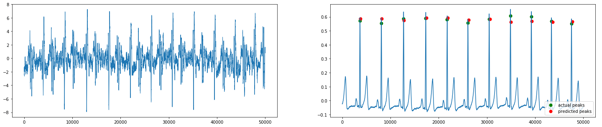

# SeismoNet

This repository contains code used for the paper "End-to-End Deep Learning for Reliable Cardiac Activity Monitoring using Seismocardiograms" which has been accepted for presentation at the [19th International Conference on Machine Learning and Applications](https://www.icmla-conference.org/icmla20/index.html), Boca Raton, FL, USA.

SeismoNet is a Deep Convolutional Neural Network which aims to provide an end-to-end solution to robustly observe heart activity from Seismocardiogram (SCG) signals. These SCG signals are motion-based and can be acquired in an easy, user-friendly fashion. SeismoNet transforms the SCG signal into an interpretable waveform consisting of relevant information which allows for extraction of heart rate indices.

Preprint available at [arxiv](https://arxiv.org/abs/2010.05662) :newspaper:

## Getting Started :rocket: 

* [preprocess.py](preprocess.py) Preprocesses the CEBS dataset available at [physionet](https://physionet.org/content/cebsdb/1.0.0/)  
* [trainer.py](trainer.py) Helps train the model.
* [infer.py](infer.py) Helps take inference on any input SCG signal.
* [utils.py](utils.py) This file consists of all the helper functions.
* [model.py](model.py) SeismoNet architecture in torch

## Model Architecture


## Usage

Install all dependencies with:
```bash
$ pip install -r requirements.txt
```
Download datasets with:
```bash
$ wget -r -N -c -np https://physionet.org/files/cebsdb/1.0.0/
```
Preprocess raw data:
```bash
$ python preprocess.py --data_path /path/to/data
```
Train SeismoNet using preprocessed data:
```bash
$ python trainer.py --data_path /path/to/preprocessed/data 
```

Take inference and evaluate model:
```bash
$ python infer.py --best_model /path/to/model --data_path /path/to/preprocessed/data --evaluate
```
## Inference

          
## Authors :mortar_board:

[Prithvi Suresh](https://github.com/prithusuresh/), [Naveen Narayanan](https://github.com/naveenggmu/), Pranav CV, Vineeth Vijayaraghavan
