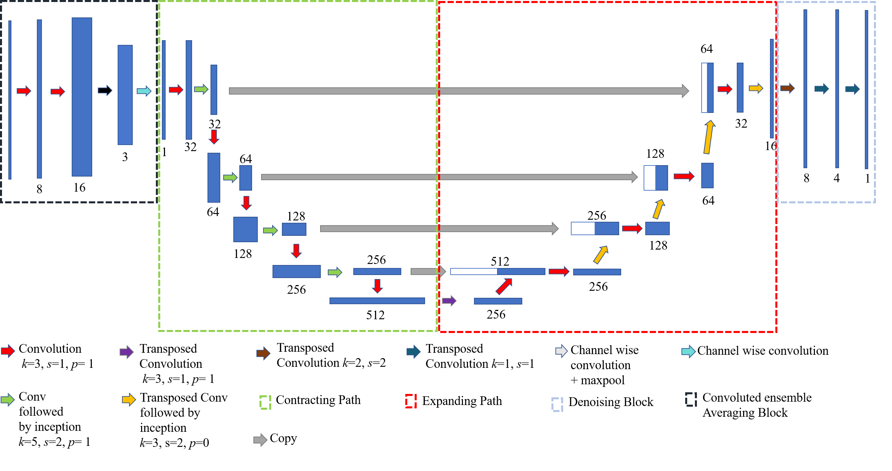
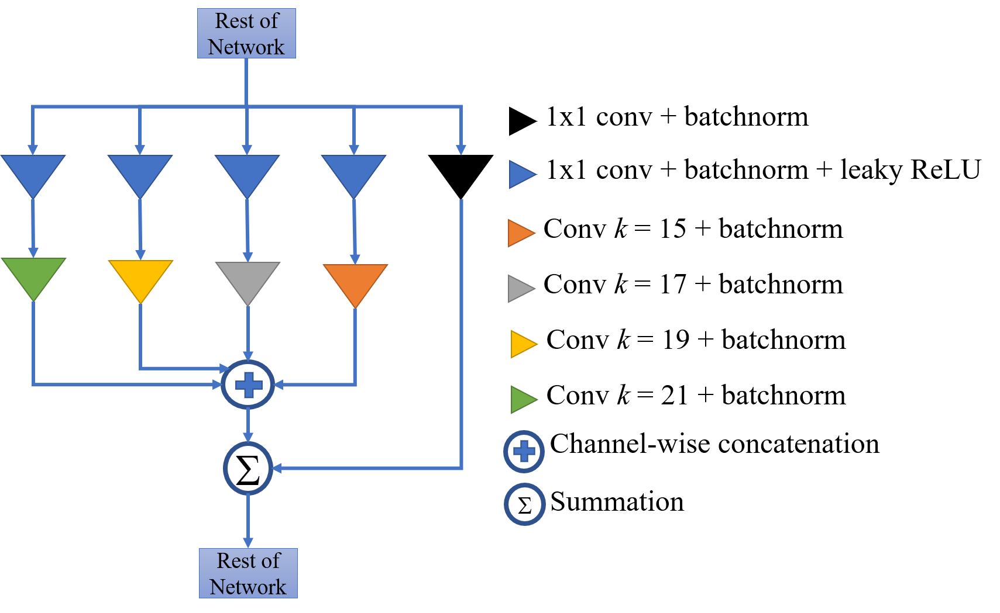

# SeismoNet

This repository contains code used for the paper "End-to-End Deep Learning for Reliable Cardiac Activity Monitoring using Seismocardiograms" which has been accepted for presentation at the 19th International Conference on Machine Learning and Applications, Boca Raton, FL, USA.

SeismoNet is a Deep Convolutional Neural Network which aims to provide an end-to-end solution to robustly observe heart activity from Seismocardiogram (SCG) signals. These SCG signals are motion-based and can be acquired in an easy, user-friendly fashion.

## Getting Started :rocket: 

* [preprocess.py](preprocess.py) Preprocesses the CEBS dataset available at [physionet](https://physionet.org/content/cebsdb/1.0.0/)  
* [trainer.py](trainer.py) Helps train the model.
* [infer.py](infer.py) Helps take inference on any input SCG signal.
* [utils.py](utils.py) This file consists of all the helper functions.
* [model.py](model.py) SeismoNet architecture in torch

## Model Architecture

SeismoNet consists of 5 blocks:
* Inception-Residual Block
* Contracting Convolutional Block (CCB)
* Expanding Convolutional Block (ECB)
* Convolutional Ensemble Averaging Block
* Denoising Block



Inception Residual Block


## Usage

Install all dependencies with:
```bash
$ pip install requirements.txt
```
Download datasets with:
```bash
$ wget -r -N -c -np https://physionet.org/files/cebsdb/1.0.0/
```
Train models with downloaded datasets:
```bash
$ python trainer.py --dataset MNIST
$ python trainer.py --dataset SVHN
$ python trainer.py --dataset CIFAR10
```
Test models with saved checkpoints:
```bash
$ python evaler.py --dataset MNIST --checkpoint ckpt_dir
$ python evaler.py --dataset SVHN --checkpoint ckpt_dir
$ python evaler.py --dataset CIFAR10 --checkpoint ckpt_dir
```
The *ckpt_dir* should be like: ```train_dir/default-MNIST_lr_0.0001_update_G5_D1-20170101-194957/model-1001```

Train and test your own datasets:

* Create a directory
```bash
$ mkdir datasets/YOUR_DATASET
```

## Authors

Prithvi Suresh, Naveen Narayanan, Pranav CV, Vineeth Vijayaraghavan
